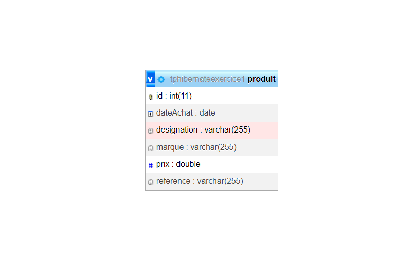
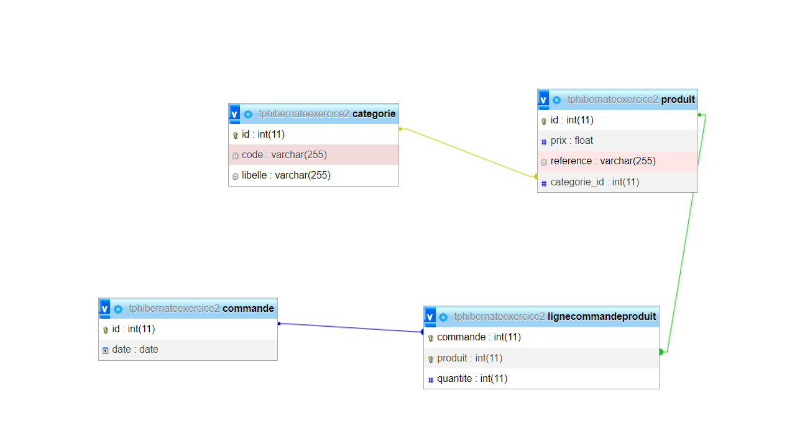
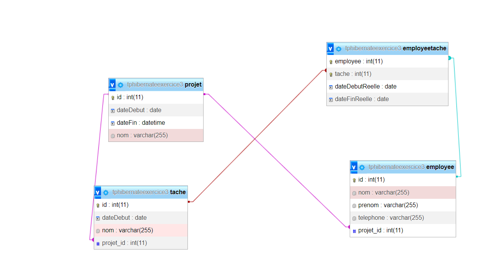
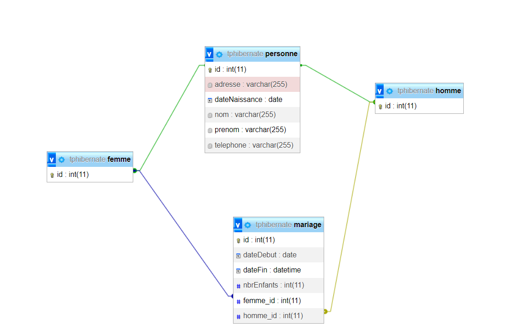

# Exercices avec Hibernate

Ce référentiel (repo) contient des exercices réalisés avec Hibernate, un framework de persistance pour Java. Les exercices sont conçus pour nous familiariser avec les concepts de Hibernate et nous aider à apprendre à utiliser cet outil de manière efficace.

## Captures d'écran

Vous trouverez ci-dessous des captures d'écran des exercices disponibles dans ce référentiel :

### TpHibernateExercice1

### TpHibernateExercice2

### TpHibernateExercice3

### TpHibernateExercice4

